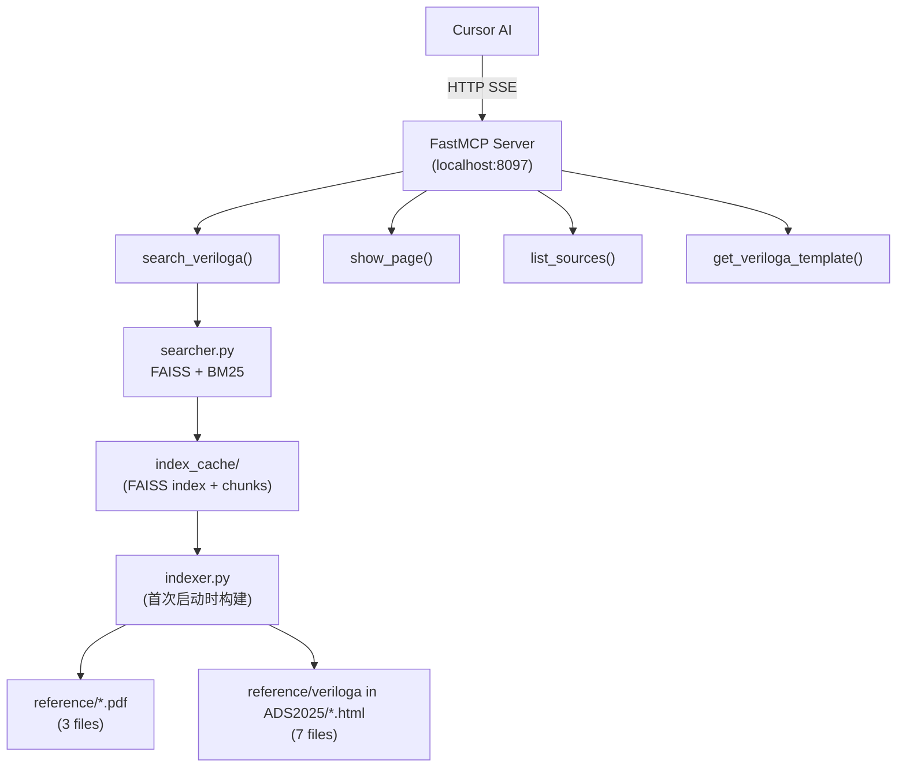

# VerilogA MCP 服务搭建指南

## 技术选型

- **框架**: FastMCP（Python）— 与现有 `ads-help` / `chipbench` 服务一致
- **传输**: HTTP SSE（本地 `localhost:8097`，之后可迁移到 `172.16.4.25`）
- **文档解析**: `pypdf`（PDF）+ `beautifulsoup4`（HTML）
- **混合检索**: `sentence-transformers` + `FAISS`（语义）+ `rank-bm25`（关键词）

## 最终目录结构

```
MCP_Veriloga/
├── reference/                    (已有文档)
├── server/
│   ├── main.py                   (FastMCP 主入口)
│   ├── indexer.py                (文档解析 + 索引构建)
│   ├── searcher.py               (混合检索逻辑)
│   ├── templates.py              (VerilogA 代码模板库)
│   ├── requirements.txt
│   └── index_cache/              (运行时自动生成，存放 FAISS 索引)
└── README.md
```

## Phase 1 — 依赖安装

`server/requirements.txt` 核心依赖：

- `fastmcp>=2.0`
- `pypdf>=4.0`
- `beautifulsoup4`
- `sentence-transformers`
- `faiss-cpu`
- `rank-bm25`
- `uvicorn`

```bash
cd server
pip install -r requirements.txt
```

## Phase 2 — 文档解析与索引（`indexer.py`）

遍历 `reference/` 下所有 PDF 和 HTML，按段落/章节切块（chunk_size ≈ 500 tokens），存储：

- `text`（原文）
- `source`（文件相对路径）
- `title`（章节标题）
- `doc_type`（`pdf` / `html`）

首次启动时自动构建并序列化到 `index_cache/`，之后直接加载。

**文档来源映射：**

- `OVI_VerilogA.pdf` → OVI 语言规范
- `VerilogA Modeling.pdf` → 建模教程
- `veriaref.pdf` → 快速参考
- `veriloga in ADS2025/veriloga/*.html` → ADS 2025 官方帮助页

## Phase 3 — 混合检索（`searcher.py`）

```python
# 语义分: sentence-transformers 编码 → FAISS 余弦相似度
# 关键词分: BM25 TF-IDF 分数
# 最终分: alpha * 语义 + (1-alpha) * 关键词, alpha=0.6
```

## Phase 4 — MCP 工具定义（`main.py`）

实现 4 个工具：


| 工具                      | 参数                             | 功能                                        |
| ----------------------- | ------------------------------ | ----------------------------------------- |
| `search_veriloga`       | `query: str`, `top_k: int = 5` | 混合检索，返回最相关段落                              |
| `show_page`             | `source_file: str`             | 返回指定文档的完整内容                               |
| `list_sources`          | —                              | 列出所有可用文档及简介                               |
| `get_veriloga_template` | `model_type: str`              | 返回常见模型类型的 VerilogA 代码模板（电阻、电容、二极管、VCCS 等） |


服务器启动方式：

```python
mcp.run(transport="sse", host="0.0.0.0", port=8097)
```

## Phase 5 — 本地注册到 Cursor

编辑 `C:\Users\sn06071\.cursor\mcp.json`，在 `mcpServers` 中新增：

```json
"veriloga-help": {
  "url": "http://localhost:8097/mcp/sse"
}
```

然后运行服务：

```bash
python server/main.py
```

重启 Cursor 后即可在 AI 中使用 VerilogA 文档检索。

## Phase 6 — 创建 Cursor 本地描述符缓存

在 `C:\Users\sn06071\.cursor\projects\d-Users-Documents-GitHub-MCP-Veriloga\mcps\user-veriloga-help\` 下创建与现有服务相同格式的文件：

- `SERVER_METADATA.json`
- `INSTRUCTIONS.md`（AI 的系统提示词）
- `tools/search_veriloga.json` 等工具描述符

（Cursor 首次连接成功后会自动生成，也可手动创建以自定义 AI 行为。）

## Phase 7 — 迁移到远程服务器

服务验证稳定后，将 `server/` 目录及 `reference/` 文档复制到 `172.16.4.25`，选一个空闲端口（如 8096），以 systemd service 或 supervisor 守护进程运行，然后将 `mcp.json` 中的 URL 改为 `http://172.16.4.25:8096/mcp/sse`。

## 架构数据流




